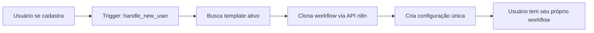

# 🚀 Guia de Configuração - N8N + SaaS

## 📋 **CONFIGURAÇÃO RÁPIDA**

### 1. **Configure suas Credenciais N8N**

Edite o arquivo `.env` e substitua os valores:

```env
# Suas configurações reais do n8n
VITE_N8N_BASE_URL=https://sua-instancia-n8n.com
VITE_N8N_API_KEY=sua-chave-api-aqui
VITE_N8N_TEMPLATE_WORKFLOW_ID=123  # ID do workflow que será clonado
```

### 2. **Como Encontrar o ID do Workflow no N8N**

1. Acesse seu n8n
2. Abra o workflow que deseja usar como template
3. Na URL você verá algo como: `https://n8n.com/workflow/123`
4. O número `123` é o ID que deve ir no `.env`

### 3. **Como Funciona a Clonagem**



## 🛠️ **ESTRUTURA DO WORKFLOW TEMPLATE**

### Seu workflow no n8n deve ter:

1. **Webhook Node** - Para receber dados
2. **OpenAI/DALL-E Node** - Para gerar imagens
3. **Response Node** - Para retornar resultados

### Exemplo de resposta esperada:
```json
{
  "images": [
    "https://url-da-imagem-1.jpg",
    "https://url-da-imagem-2.jpg",
    "https://url-da-imagem-3.jpg"
  ]
}
```

## 🔄 **PROCESSO DE AUTO-CLONAGEM**

Quando um usuário se cadastra:

1. ✅ **Perfil criado** na tabela `profiles`
2. ✅ **Workflow clonado** via API do n8n
3. ✅ **Configuração salva** na tabela `n8n_configurations`
4. ✅ **Créditos adicionados** na tabela `credits`
5. ✅ **Workflow ativo** pronto para uso

## 🧪 **TESTANDO A CONFIGURAÇÃO**

### Após configurar o `.env`:

```bash
# 1. Execute o script de configuração
./scripts/configure-n8n-template.sh

# 2. Aplique a migração 005
# (via dashboard do Supabase ou comando SQL)

# 3. Teste criando uma nova conta
# Acesse: http://localhost:8080
```

### Verificações importantes:

- ✅ Template existe na tabela `n8n_workflow_templates`
- ✅ Workflow foi clonado na conta do usuário
- ✅ Configuração aparece na tabela `n8n_configurations`
- ✅ Usuário pode gerar imagens

## 🔍 **DEBUGANDO PROBLEMAS**

### 1. **Workflow não foi criado automaticamente**
- Verifique se a migração 005 foi aplicada
- Confirme se existe um template ativo
- Veja os logs na tabela `processing_logs`

### 2. **Erro ao clonar workflow**
- Verifique credenciais do n8n no `.env`
- Confirme se o workflow template existe no n8n
- Teste a API do n8n manualmente

### 3. **Geração de imagens não funciona**
- Verifique se o webhook está configurado
- Confirme se o workflow tem os nodes corretos
- Teste o workflow diretamente no n8n

## 💡 **DICAS IMPORTANTES**

1. **Para Desenvolvimento**: O sistema usa mock images se n8n não estiver configurado
2. **Para Produção**: Configure instância n8n estável e credenciais seguras
3. **Templates**: Você pode ter múltiplos templates para diferentes tipos de geração
4. **Escalabilidade**: Cada usuário tem seu próprio workflow isolado

## 🎯 **RESUMO DOS ARQUIVOS**

- **`.env`**: Suas credenciais e configurações
- **Migração 005**: Auto-criação de workflows
- **Migração 006**: Template padrão
- **Script configure-n8n-template.sh**: Automatiza configuração
- **DebugPanel**: Mostra status das configurações

**🚀 Com essas configurações, cada usuário que se cadastrar receberá automaticamente uma cópia do seu workflow personalizada!**
